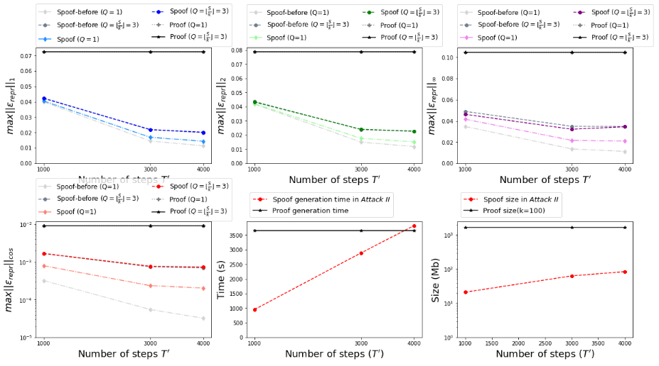

# Responses to “Are adversarial examples against proof-of-learning adversarial?”

*by Rui Zhang, Yuan Ding, Jian Liu and Kui Ren*

In 2021 IEEE Symposium on Security and Privacy (SP), Jia et al. published “[Proof-of-Learning: Definitions and Practice](https://www.computer.org/csdl/proceedings-article/sp/2021/893400b832/1t0x9JPSLzG)”, which proposes a new concept named proof-of-learning (PoL) that can be used to “prove” the computation expended towards training a deep learning model. This year, in the same conference, we published “[Adversarial Examples for Proof-of-Learning](https://www.computer.org/csdl/proceedings-article/sp/2022/131600b542/1CIO7O6P4Uo)”, which shows that PoL is vulnerable to adversarial examples. Recently, the authors of PoL wrote a [blog post](http://www.cleverhans.io/2022/05/22/pol-attack.html) raising some questions about our attacks. Here, we answer their questions and show that PoL is still vulnerable. (The sentences below inside boxes are directly quoted from their post.)

## About the cost of our attacks

| *“However, optimizing for the data points that lead to such state transitions is a second order non-convex problem in the setting of deep learning, which is computationally costly, and can potentially exceed the cost of training. ”* |
| ------------------------------------------------------------ |

We agree that computing a second-order non-convex is computationally costly. However, one key point in our attack is that “the number of training steps $T’$ in a PoL spoof is NOT required to be identical to the number of training steps $T$ in a PoL proof”, which is consistent with the assumptions made by the PoL paper (cf. “stochastic spoofling” in Section IV.A of their paper). Note that our attack requires computing derivative of the $l_2-norm$ of the first-order derivative for $T’$ times, whereas training the model requires computing first-order derivative for $T$ times. **Therefore, we could choose a $T’$ that is smaller than $T$ to make sure our attack is less costly than training the model.**

Denote the cost of training by $O(T\times c)$, where $c$ is the number of parameters; the cost of our attack (Attack I and Attack II) is $O(T’\times(c+d)\times N),$ where *d* is the input dimensions and *N* is the number of iterations needed to create an adversarial example. Therefore, we only need to set *T’* to be smaller than $O(\frac{T\times c}{(c+d)\times N}).$ Our experiments show that *N* can be as small as 10 in Attack II.

 

However, we still want to make $T’$ as large as possible to make the spoof indistinguishable from the proof. Our optimized attack (i.e., Attack III) only requires computing derivative of the $l_2-norm$ of the first-order derivative for $\frac{T’}{k}$ times, where $k$ is the number of batches in a checkpointing interval. As a result, we only need to set $T’$ to be smaller than $O(\frac{T\times k\times c}{(c+d)\times N}).$ Our experimental results show that we can have a $T’$ that is comparable to $T$ with a spoofing time that is still much smaller than training  (cf. Figures 5 6 7 in our paper). 

## About the discrepancy in experimental results

| *“How could the reproduction error (even for the benign proofs) be smaller by an order of 10 in the attack paper? In the PoL paper, when experiments for the PoL creation and PoL verification were conducted on two different machines, trying the best to fix all source of randomness including using deterministic operations provided by PyTorch was unable to reduce the error by this much; and only conducting the experiments on the same machine could lead to such a small error. This suggests that the authors of the attack paper tested their attack and verified it on the same machine. In other words, this would amount to implicitly assuming that the adversary is capable of using the same machine than the verifier uses. This is a strong assumption, at which point the attacker has gained capabilities that make attacking PoL futile. Unfortunately, at the time of writing, the authors did not provide us with code to reproduce their results. ”* |
| ------------------------------------------------------------ |

The smaller reproduction errors are caused by the fact that during verification we removed the randomness (of data transform) in the data loading period. However this equally affects the reproduction errors of both the PoL proof and the PoL spoof. We re-ran our experiments (of course on different machines) by adding such randomness. Now, the reproduction errors are somehow consistent with the PoL paper, and our attack can still succeed (see the pictures bellow).

 

Our open-sourced code can be found [here](https://github.com/ZhangRui98/Adversarial-examples-for-Proof-of-Learning).

(https://github.com/ZhangRui98/Adversarial-examples-for-Proof-of-Learning)

 

# About the checkpointing intervals

| *“Additionally, the attack paper assumes that the adversary has the ability to control the checkpointing interval. This is a misunderstanding of the original PoL paper, where the verifier should be the one setting this parameter. In fact, by simply using a smaller checkpointing interval (i.e. k=10), it is found that the proposed attack failed for the CIFAR-100 dataset.”* |
| ------------------------------------------------------------ |

First of all, **it is the original PoL paper that assumes the adversary has the ability to control the checking pointing interval.** In Section IV.A of the PoL paper, they wrote: “*We consider the following scenarios for spoofing…(b) Stochastic Spoofling: A* (which is the attacker) *aims to create a valid PoL for fw_T, but this may not be the same as T’s PoL*”.That means the attacker is allowed to come up with a PoL spoof that is totally different from the PoL proof, including the checkpointing interval.

 

Secondly, in the original PoL paper (Section VI.C, tagged paragraph-4), they wrote: “*Common practice when training DNNs is to checkpoint at every epoch (i.e., k=S) … In particular, if the prover only utilizes the checkpoints saved roughly at every epoch (k≈S), they can still… In Figures 1, 2 and Table I for the CIFAR-10 dataset, we observe that using k=S outperforms creating PoL with the deterministic operations...*” **All these sentences in the original PoL paper implicitly suggest to set “k = S = 390”**. In our experiments, we set k=100, which is smaller than 390.

Thirdly, **setting k=10 will lead to a supper large proof size (hundreds of GBs)**, which won’t be practical.

## About accessing the training data                     

| *However, as we have explained earlier, these issues are easily addressed once the adversary is prevented from directly accessing the training data. The original PoL paper describes a mechanism to do just that: provide a hash of the data along with the PoL, rather than the data itself.* |
| ------------------------------------------------------------ |

In the threat model of the original PoL paper (Section IV.A), **the authors clearly wrote: “*A* (which is the attacker) *has full access to the training dataset, and can modify it.* ”** We simply follow this threat model. Denying access to the training data means changing the threat model. In a security conference like SP, changing the threat model is equal to changing the whole scheme.

Furthermore, **our attack can succeed even without accessing the training data**. In one of our experiments, we split the dataset CIFAR-10 into two non-overlapping datasets: prover generates the PoL proof from first dataset and attacker generates the PoL spoof from second one. Figures 8 and 9 show that we can still spoof PoL when the two training datasets are non-overlapping. That means our attack could succeed as long as the attacker knows the distribution of the training data.

## About the timestamping

| *Coupled with timestamping of the PoL (as discussed in the original PoL proposal), this greatly reduces the aforementioned threat surface.* |
| ------------------------------------------------------------ |

**If a robust timestamping mechanism exists (which is a strong assumption), why do we need PoL at all?** The prover can simply timestamp his model; whenever anyone presents the same model, the prover only needs to show that his timestamp is earlier.

In the original PoL paper (Section VIII. Discussions & Limitations), the authors wrote: "*However, a PoL cannot be used to connect the model to its surrogate, neither can it be used avoid extraction. Instead, a PoL provides legal protection: if the trainer produces a PoL and publishes a time-stamped signature of it, this unchangeable record proves ownership in case of false claim by a surrogate model owner.*" That means PoL is not able to prevent the attacker from making minor changes to the stolen model; instead it only helps if the suspect model and the original model are identical. However, a robust timestamping mechanism is enough to prevent the later.

 

## About theoretical intuition

| *Our discussion suggests that in such settings, the optimization problem required to create falsified proofs does not converge (and there’s currently no theoretical intuition as to when it may).* |
| ------------------------------------------------------------ |

Firstly, **our experimental results show that the optimization problem does converge, and it is backed by the theoretical intuition of adversarial examples.**

Secondly, why do we need theoretical intuition for attacks? When we want to prove something is correct, we need to come up with a comprehensive proof with solid theoretical foundations. On the other hand, when we want to prove something is wrong, we simply need to show a counterexample.

## Conclusion

We agree that PoL is an interesting idea. However, as an anonymous reviewer of our paper said: “The original proposal of Jia et al. seemed somewhat ad-hoc, so it is not too surprising to see a successful attack on it.” We believe that PoL can be fixed (in fact, we did propose several countermeasures in our paper). However, we expect a formal security proof to make potential users really reassured.